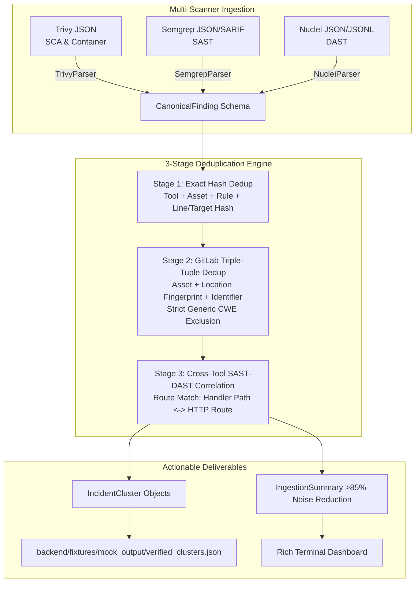

# CyberYukti 🛡️
### Autonomous Vulnerability Triage & Evidence Engine (PS16)

> **Problem Statement PS16**: Build an autonomous triage and evidence engine that ingests high-volume, noisy outputs from heterogeneous security scanners, standardizes findings into canonical incident models, collapses alert duplicates using enterprise-grade triple-tuple standards, and correlates cross-tool evidence to surface high-priority, actionable vulnerabilities.

---

## 👥 Hackathon Team & Person 1 Scope

CyberYukti is divided across 4 specialized roles:
- **Person 1 (This Repository)**: **Finding Intelligence & Deduplication Engine** (Multi-scanner normalization, GitLab Enterprise Triple-Tuple deduplication, and cross-tool SAST-to-DAST route correlation).
- **Person 2**: **Context & Graph Engine** (Asset dependency graph, EPSS scoring, CISA KEV live catalog enrichment).
- **Person 3**: **Autonomous Evidence Engine** (Dynamic exploitability verification, payload validation, evidence ledger).
- **Person 4**: **Auto-Remediation & Response** (Automated patch generation, dependency bump PRs, mitigation playbooks).

---

## 🧠 Person 1 Architecture: Finding Intelligence & Deduplication

Modern AppSec pipelines suffer from extreme alert fatigue: container scanners flag the same base library across hundreds of layers, SAST tools report duplicate issues across minor line variations, and DAST tools hammer the same route with dozens of payloads.

Person 1 solves this with a deterministic, multi-stage pipeline that collapses raw findings into high-fidelity **Incident Clusters** with **>85% noise reduction** (achieving **90.48%** in verified benchmarks).



---

## 🔑 Key Engineering Principles

### 1. Canonical Schema (`backend/app/ingestion/models.py`)
All heterogeneous scan formats (Trivy, Semgrep, Nuclei) are transformed into a single canonical Pydantic model:
- `CanonicalFinding`: Contains unified fields (`finding_id`, `tool_name`, `scan_type`, `title`, `cve_id`, `cwe_ids`, `raw_severity`, `target_asset`, `file_path`, `line_number`, `http_endpoint`, `http_method`, `package_name`, `installed_version`, `fixed_version`, `raw_payload`).
- `IncidentCluster`: Represents an aggregated, deduplicated vulnerability incident ready for downstream triage.
- `IngestionSummary`: Quantifies raw alert volume vs. cluster count and computes noise reduction percentage.

### 2. 3-Stage Deduplication Engine (`backend/app/ingestion/deduplicator.py`)
- **Stage 1 (Exact Hash Deduplication)**: Eliminates identical alerts triggered by the same tool on identical coordinates.
- **Stage 2 (GitLab Enterprise Triple-Tuple Standards)**:
  - Groups by `[Asset Identifier] + [Location Fingerprint] + [Vulnerability Identifier]`.
  - **Strict Rule on Generic CWEs**: Solitary generic CWEs (`CWE-79`, `CWE-22`, `CWE-89`, `CWE-20`, `CWE-200`, `CWE-287`) are strictly **forbidden** from grouping across different locations. Two distinct vulnerabilities only sharing "CWE-79" on different files remain isolated clusters.
  - **SCA/Container**: Collapses multi-layer and multi-lockfile occurrences of the same package and CVE on the asset.
  - **SAST**: Aggregates multi-line noise within the same component/rule.
  - **DAST**: Groups parameter variations on the same normalized endpoint route.
- **Stage 3 (Cross-Tool SAST-to-DAST Route Correlation)**:
  - Connects static code controller files (`handlers/static.py`) serving endpoints (e.g. `/api/static/download`) with active runtime DAST findings hitting `/api/static/download`.
  - Merges static flaw evidence and dynamic runtime proof into a unified cluster (`participating_tools: ["nuclei", "semgrep"]`).

---

## 📊 Benchmark & Verification Results

Running against synthetic, realistic multi-scanner scan fixtures:
- **Trivy SCA/Container**: 25 raw findings (`aiohttp` CVE-2023-38606 across 15 targets + `libssl3` CVE-2023-0286 across 10 layers).
- **Semgrep SAST**: 12 raw findings (8 path traversal lines in `handlers/static.py` + 4 auth checks in `admin/auth.py`).
- **Nuclei DAST**: 5 raw findings (3 active path traversal payloads on `/api/static/download` + 2 auth bypass payloads on `/api/admin/auth`).

```
Total Raw Findings Ingested  : 42
Actionable Incident Clusters : 4
Noise Reduction Percentage   : 90.48% (Target: >85%)
```

### Triaged Clusters Output:
1. **`CLUST-001`**: `[Correlated SAST+DAST] Path Traversal in /api/static/download (CVE-2023-38606)` (11 findings collapsed | Tools: `nuclei`, `semgrep`).
2. **`CLUST-002`**: `[Correlated SAST+DAST] Improper Authentication in /api/admin/auth` (6 findings collapsed | Tools: `nuclei`, `semgrep`).
3. **`CLUST-003`**: `[SCA] aiohttp: Directory traversal vulnerability in HTTP server static file handling (CVE-2023-38606)` (15 findings collapsed | Tools: `trivy`).
4. **`CLUST-004`**: `[Container] openssl: X.400 address type confusion in GENERAL_NAME_cmp (CVE-2023-0286)` (10 findings collapsed | Tools: `trivy`).

---

## 🚀 Getting Started

### 1. Installation
Ensure Python 3.10+ is installed, then install the dependencies:
```bash
pip install -r requirements.txt
```

### 2. Run Test Suite
Run the comprehensive Pytest verification suite:
```bash
python -m pytest backend/tests/test_ingestion.py -v
```

### 3. Run Standalone Pipeline
Execute the end-to-end finding ingestion, deduplication, and export pipeline:
```bash
python run_standalone.py
```
This prints the Rich summary tables and generates `backend/fixtures/mock_output/verified_clusters.json`.

---

## 🤝 Downstream Integration Contract (Persons 2, 3, 4)

The output JSON file `backend/fixtures/mock_output/verified_clusters.json` conforms to the canonical Pydantic model:
- **Person 2 (Graph & Enrichment)**: Read `clusters[].primary_cve` to query EPSS scores and CISA KEV catalog; link `clusters[].affected_component` to the dependency graph.
- **Person 3 (Evidence Engine)**: Inspect `clusters[].normalized_route` and `clusters[].representative_finding` to construct automated dynamic exploit verification scripts.
- **Person 4 (Auto-Remediation)**: Use `clusters[].representative_finding.package_name` and `clusters[].representative_finding.fixed_version` to generate lockfile bump Pull Requests.
